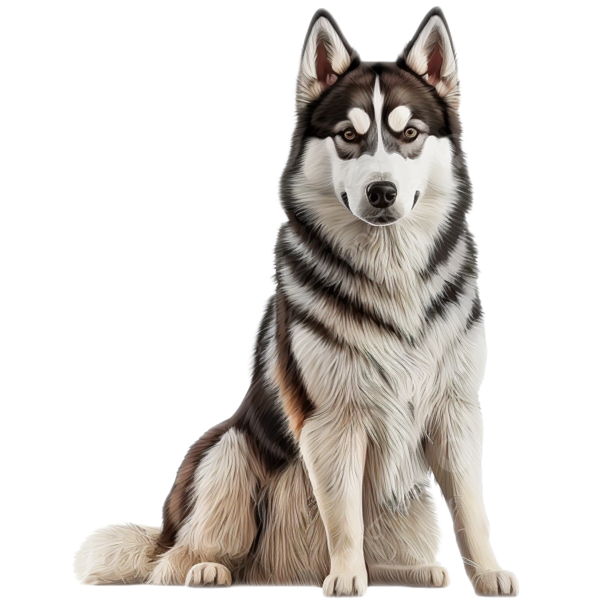
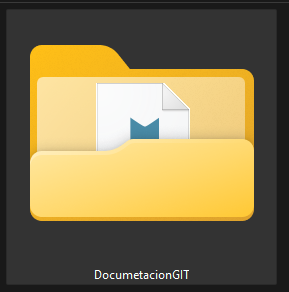
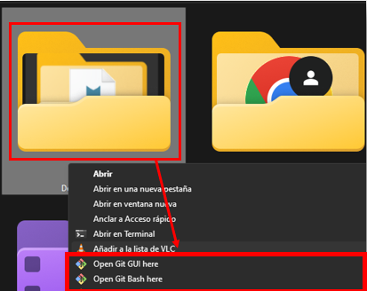
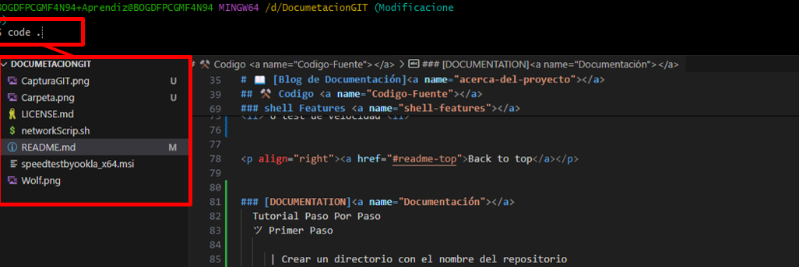

<a name="readme-top"></a>


<div align="center">


<br/>
<h3><b>Blog de Documentación GIT</b>

</div>

# ✅ TABLE OF CONTENTS
- [📖 Blog de Documentación](#acerca-del-proyecto)
- [🚩​ Documentation](#Git-Comandos)
  - [⚒️ Codigo ](#Codigo-Fuente)
    - [Stack de Tecnologia](#tech-stack)
    - [shell Features](#shell-features)
 - [🚀 Live Demo](#live-demo)
 - [💻 Getting Started](#getting-started)
   - [Setup](#setup)
   -  [Prerequisites](#prerequisites)
   - [Install](#install)
   - [Usage](#usage)
   - [Run tests](#run-tests)
   - [Deployment](#deployment)
- [👥 Authors](#authors)
- [🕹️ Future Features](#future-features)
- [🤝 Contributing](#contributing)
- [⭐ Show your Support](#support)
- [👏 Acknowledgements ](#ackknowledgements)
- [❓ FAQ ](#faq)
- [📃 License](#license)

# 📖 [Blog de Documentación]<a name="acerca-del-proyecto"></a>

**[Blog de Documentación]** En la siguiente documentación se explica el uso de GIT y SHELL por comando.

## ⚒️ Codigo <a name="Codigo-Fuente"></a>

<p>
Este proyecto utilizo los siguientes lenguajes:
HTML, MARKDOWN AND SHELLSCRIPT, GIT, GITHUB
</p>

### Stack de Tecnologia <a name="tech-stack"></a>

<li> HTML </li>
<li> MARKDOWN </li>
<li> SHELLSCRIPT </li>
<li> GIT </li>
<li> GITHUB </li>

<details>
<summary> Client </summary>
    <ul>
    <li><a href="https://developer.mozilla.org/es/docs/Web/HTML">HTML</a></li>    
    </ul>
</details>

<details>
<summary>Markdown</summary>
<ul>
<li><a href="https://markdown.es/sintaxis-markdown/">Markdown</a></li>
</ul>
</details>


### shell Features <a name="shell-features"></a>
<li> 1 Prueba de Conectividad <li>
<li> 2 Mostrar Configuracion de Red <li>
<li> 3 Tabla de enrutamiento <li>
<li> 4 resolucion de nombres DNS <li>
<li> 5 revisar puertos de la maquina <li>
<li> 6 test de velocidad <li>


<p align="right"><a href="#readme-top">Back to top</a></p>


### [DOCUMENTATION]<a name="Documentación"></a>
  Tutorial Paso Por Paso
  ツ Primer Paso 

     | Crear un directorio con el nombre del repositorio



     | Ejecutar la carpeta con git bash



     | Para iniciar la ejecucion en visual studio se utiliza code . que permite abrir el directorio con VS 



     | En este caso se creara un archivo sh en cual se utilizara varios parametros para identificar la red de la siguiente manera


     | ahora se ejecutara la terminal git con ctrl+shift+ñ y agregar bash - una ves hecho esto ejecutaremos git init que permite que la carpeta cree un local master para los archivos 


     | una ves procedido esto podemos observar el estado de los archivos con git status


  
    
## 💻 Getting Started <a name="getting-started"></a>


To get a local copy up and running follow these steps:

### Prerequsites 

To run this project you need the following tools:

- [VS Code]
- [Git and GitHub]
- [ShellScript ]

### Setup

Clone this respository  to your desired folder:

```sh
cd NEWTORK-SCRIPT
git clone https://github.com/alyconr/Network-Shell-Script-.git
```
### Install

Install This project with:

```sh
    ./networkScript.sh
```

### Usage 

To run the project, execute the following command:

```sh
./networkScript.sh
```

### Run Test

To run test, run the following command or endpoint:

```sh
python -m unittest test_module.TestClass
```


### Deployment

Deploy using your local enviroment

<p align="right"><a href="#readme-top">Back to top</a></p>

## 👥 Authors <a name="authors"></a>

Jeysson Contreras

🧑🏻‍💻 **Author 1**

 - GitHub: [@alyconr](https://github.com/alyconr)
 - LinkedIn: [LinkedIn](https://www.linkedin.com/in/jeysson-aly-contreras)


## 🕹️ Future Features <a name="future-features"></a>

- [ ] **[Ping]**
- [ ] **[Nslookup]**
- [ ] **[BandWitdth Test]**


## 🤝 Contributing <a name="contributing"></a>


Contributions, issues, and  feature requests are welcome!

Feel free tp check the [issues page](https://github.com/alyconr/Network-Shell-Script-/issues)


## ⭐ Show your Support

Wrrite a message to encourage readers to support your project

If you like this project please give one start

## 👏 Acknowledgements <a name="acknowledgements"></a>

I would like to thank my learning teammates  and Sena Instructor

## 📃 License <a name="license"></a>

This Project is [MIT](./LICENSE.md) licensed

<p align="right"><a href="#readme-top">Back to top</a></p>


